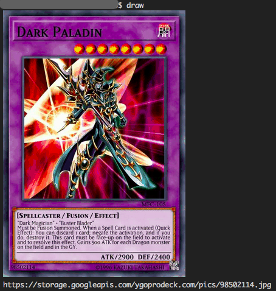

# draw

Draw Yu-Gi-Oh! Card.

## Installation

```
$ go get github.com/Doarakko/draw
```

## Usage

```
$ draw
```



## Credits

- [Yu-Gi-Oh! API by YGOPRODeck](https://db.ygoprodeck.com/api-guide/)
- [mattn](https://github.com/mattn)
  - [nyanko](https://github.com/mattn/nyanko)

## License

MIT
